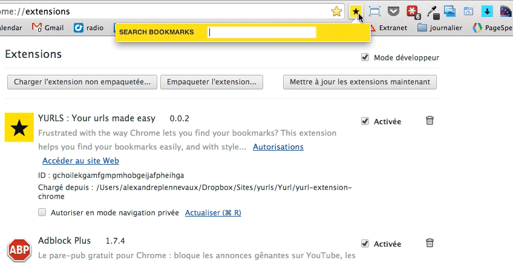

# Yurl
Yurl is a simple chrome extension that helps you search through your bookmarks using a simple "show as you type" search field, and showing you a list of the last 100 bookmarked addresses.

## Preview

Say you want to find a bookmark related to a CSS piece of code... 

## Installation

Go the [Play store](https://chrome.google.com/webstore/detail/yurls-find-your-urls-easi/anpcbhoofnndmkigbbnpcjbdndkcndhg) and click on the big fat Green button that says: "Add to chrome".

## Issues, suggestions?
Please post any issues and feature requests using Yurl [Github Issues](https://github.com/pixeline/Yurl/issues) page.

## Note on the privacy of your data.
The extension needs a few permissions that could look "scary" when it first asks you to accept them. This is why I publish the extension code on GitHub: so you can see nothing is stored nor used. 
You can doublecheck that the extension only does what it is supposed to do.

Enjoy :)
